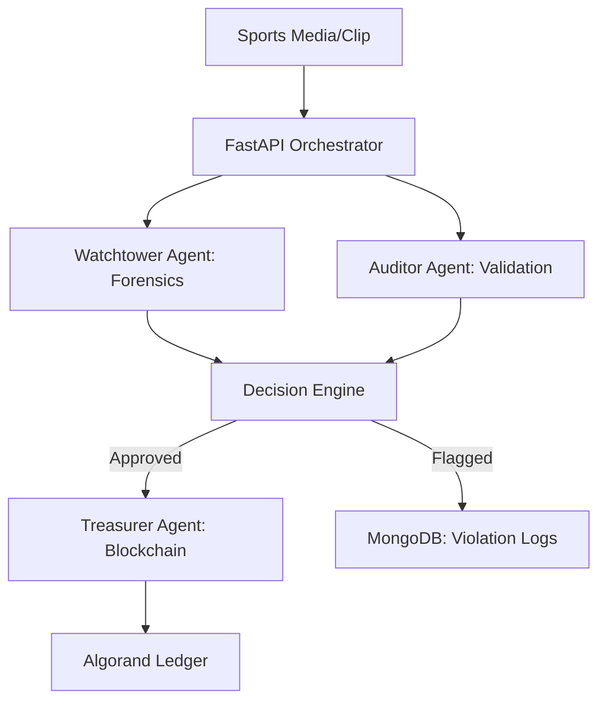

# 🛡️ AegisNet-X: Sports Media War Room
### Digital Asset Protection | Real-Time Forensic Provenance | Algorand Blockchain

**AegisNet-X** is an AI-powered orchestration framework designed specifically for sports organizations to identify, track, and flag unauthorized use of official media. It creates an immutable "Digital Fingerprint" vault on the Algorand blockchain, allowing organizations to maintain absolute control over their high-value proprietary content.

---

## 🚀 The Vision: Solving the "Sports Media Gap"
Sports organizations generate massive volumes of high-value digital media (match highlights, exclusive interviews, high-res photos). Once these hit the internet, they rapidly scatter, making it impossible to track ownership. 

**AegisNet-X** addresses this by:
- **Watchtower (Forensic Agent)**: Automatically analyzing media for tampering, deepfake indicators, or unauthorized broadcast overlays.
- **Auditor (Consensus Agent)**: Validating forensic findings to ensure high-accuracy flagging.
- **Treasurer (Provenance Agent)**: Registering asset hashes and licensing metadata on the **Algorand Blockchain** for permanent, verifiable proof of ownership.

## 🛠️ Tech Stack
- **Backend**: FastAPI (Python)
- **AI Orchestration**: Multi-Agent System (Llama-3 via Groq)
- **Database**: MongoDB (Real-time storage)
- **Blockchain**: Algorand (Testnet) for Asset Provenance
- **Frontend**: React + Vite (Neo-Brutalist Design System)

## 🏗️ Project Architecture

## 🏁 Hackathon Roadmap (Solution Challenge)
See the full development roadmap in [task.md](file:///C:/Users/Debangshu05/.gemini/antigravity/brain/31f7a742-742b-474c-8a66-cb081e938469/task.md).

1. **Digital Fingerprinting**: Immediate on-chain registration of official match-day media.
2. **Anomaly Detection**: AI-driven detection of "leaked" or "tampered" clips.
3. **War Room Dashboard**: A premium UI for real-time monitoring of media propagation.

---
*Built for the 2026 Solution Challenge - Theme: Digital Asset Protection.*
